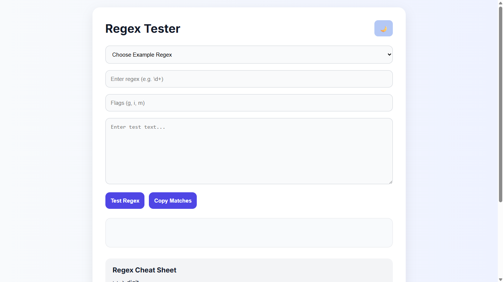
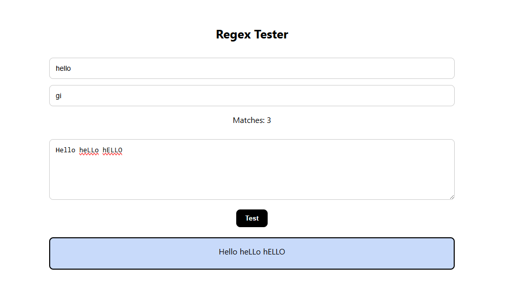

# Regex Tester

> A modern and interactive Regular Expression testing tool built with HTML, CSS, and JavaScript that allows users to test regex patterns in real time with instant highlighting, match statistics, capture groups, and dark mode support.


---

# Live Demo

**Try it here:**  
[Live Website](https://regex-tester-nine-mu.vercel.app/)

---

# Preview

<p align="center">
  
</p>

<p align="center">
  
</p>

---

# Features


## Core Features

- Real-time regex testing
- Instant text match highlighting
- Regex flags support (`g`, `i`, `m`, `s`, `u`, `y`)
- Match counter
- Capture group detection
- Invalid regex error handling
- Fully responsive interface


## UI Features

- Modern glassmorphism-inspired UI
- Dark / Light mode toggle
- Animated highlighted matches
- Clean typography using Inter font
- Mobile-friendly responsive design

---

## Advanced Features

- Regex cheat sheet
- Predefined regex examples
- Execution time measurement
- Character & line statistics
- Copy matched results to clipboard
- Real-time regex evaluation while typing

---

# Tech Stack

| Technology | Purpose |
|------------|----------|
| HTML5 | Application Structure |
| CSS3 | Styling & Responsive Design |
| JavaScript (ES6) | Regex Logic & DOM Manipulation |

---

# How It Works

1. Enter a regex pattern
2. Add optional regex flags
3. Type or paste your test string
4. Instantly view highlighted matches
5. Analyze match count, groups, and stats

---

# Getting Started

## Clone the Repository

```bash
git clone https://github.com/Anurag-3112/regex-tester.git
```

## Open the Project

```bash
cd regex-tester
```

Then simply open:

```bash
index.html
```

in your browser.

---

# Example Regex Patterns

| Purpose | Regex |
|----------|--------|
| Match Digits | `\d+` |
| Match Email | `[A-Za-z0-9._%+-]+@[A-Za-z0-9.-]+\.[A-Za-z]{2,}` |
| Match Phone Number | `\d{10}` |
| Match Date | `\d{2}/\d{2}/\d{4}` |

---

# Project Structure

```bash
regex-tester/
│── index.html
│── style.css
│── script.js
│── assets/
│   ├── screenshot1.png
│   └── screenshot2.png
```

---

# Future Improvements

- [ ] Save recent regex history
- [ ] Export results as JSON
- [ ] Syntax-highlighted regex editor
- [ ] Regex explanation generator
- [ ] Keyboard shortcuts support
- [ ] Multi-theme customization

---

# What I Learned

This project helped me strengthen my understanding of:

- JavaScript Regular Expressions
- Dynamic DOM Manipulation
- Error Handling
- Clipboard API
- Responsive UI/UX Design
- Real-Time Rendering Techniques
- Performance Optimization

---

# Contributing

Contributions are welcome!

If you'd like to improve this project:

1. Fork the repository
2. Create a feature branch
3. Commit your changes
4. Open a Pull Request

---

# Author

### Anurag Kumar
Frontend Developer | JavaScript Enthusiast

GitHub: [@Anurag-3112](https://github.com/Anurag-3112)  

---

# If you like this project...


If you found this project useful:

- Give it a ⭐ on GitHub
- Share it with others
- Contribute to the project
